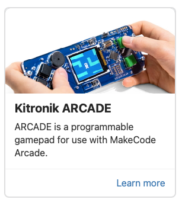
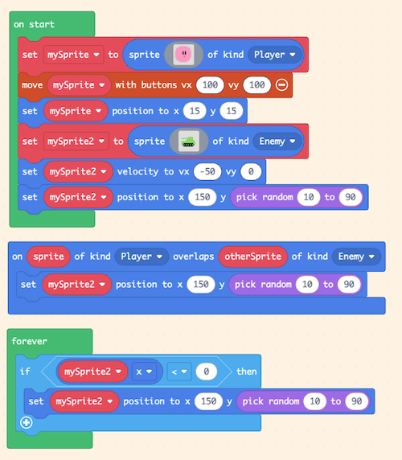

# Makecode Arcade Hackathon CLE 4

- Sluit de kitronic makecode arcade aan op je laptop.
- ⚠️ als de arcade usb drive niet herkend wordt, moet je de arcade aan/uit zetten terwijl de usb is aangesloten. Klik "ALLOW USB accessory to connect".
- Open [MakeCode Arcade](https://arcade.makecode.com).
- Bouw een testje met de blokken.
- Klik op de download knop, kies de ***KITRONIC*** handheld als doel.
- Je game wordt als `UTF2` file gedownload.
- Sleep dit bestand op de KITRONIC USB drive via de windows explorer / finder.
- Dit zorgt ook voor automatic eject, dus je moet de arcade weer opnieuw aansluiten als je weer een game wil plaatsen.
- Optioneel: klik op "PAIR USB" om rechtstreeks naar je device te kunnen downloaden (Chrome only).

 

#### Download je game naar de Kitronic Arcade

 

## Basics

#### On Start

- maak een image voor sprite 1
- zet de start positie voor sprite 1
- beweeg sprite 1 met de joystick
- maak een image voor sprite 2
- zet de start positie en snelheid voor sprite 2

#### On Overlap

- als sprite 1 overlapt met sprite 2, dan reset sprite 2 positie

#### On Update

- Check of sprite 2 links uit beeld is gegaan, zo ja dan reset sprite 2 positie

 

 

### CMGT Arcade kast

- [Je kan je MakeCode Arcade game op de CMGT arcade kast plaatsen](https://github.com/HR-CMGT/arcade-game?tab=readme-ov-file#makecode-arcade)
