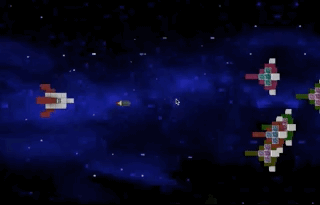
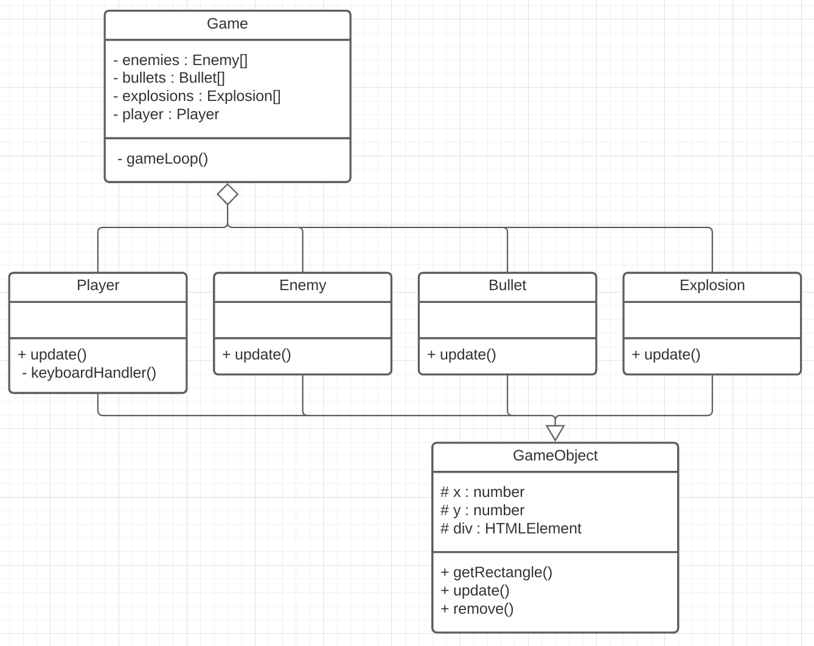

# 💥 Bullets and Explosions

## RUIMTEGRUIS



Deze week gaan we een game maken waarbij je kan schieten en explosies laten ontstaan.

- Welke class is verantwoordelijk voor bullets en explosions?
- Hoe kunnen we objecten verwijderen uit de game?



<br>
<br>

Spraak en geluid kan je toevoegen met:

```typescript
 let sound = new Audio("./sound/laser.mp3")
sound.play()

this.speech = new Speech()
this.speech.speak("destroy all enemies!")
```

<br>
<br>

## Links

- [Speech](https://github.com/HR-CMGT/PRG08-2020-2021/blob/main/snippets/speech.md)
- [Collision detection](https://github.com/HR-CMGT/Typescript/blob/master/snippets/collision.md)
- [Keyboard input](https://github.com/HR-CMGT/Typescript/blob/master/snippets/movement.md)
- [Game Loop](https://github.com/HR-CMGT/Typescript/blob/master/snippets/game.md)
