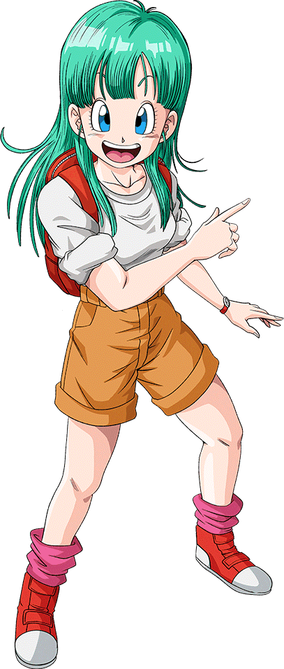

# Bulma Hackathon



> *Bouw een front-end project met een CSS framework!*

- [Programma](#programma)
- [Wat is Bulma](#wat-is-bulma)
- [Startcode](#startcode)
- [Links](#links)

<br><br><br>

## Programma

|Deel   |Tijd   |Activiteit   |
|---|---|---|
|1  |9:30 ~ 10:00 | Onderwerp kiezen  |
|2  |10:00 ~ 10:30 | Introductie Bulma.css  |
|   |10:30 ~ 12:30 | Zelfstandig werken  |
|*PAUZE* |12:30 ~ 13:00 | *PAUZE en LUNCH*  |
|3  |13:00 ~ 15:00 | Zelfstandig werken, eventueel speedcourse animatie  |
|4  |15:00 ~ 16:00 | Afsluiting en presentaties |

<br><br><br>

### HACKATHON START

Kies een van onderstaande drie onderwerpen

- Bedenk een ***fictief sportmerk of kledingmerk***
- Bedenk een ***bandnaam*** voor een band in jouw favoriete genre
- Bedenk een ***product*** dat je wil gaan verkopen in een ***shop***

Zoek vervolgens op het internet naar ***drie websites*** die over dit onderwerp gaan, en die jij erg tof vindt.

### Introductie Bulma

- Volg de introductie over het CSS framework [bulma.css](https://bulma.io)

### Zelfstandig werken ochtend

- Bouw je eigen front-end website over jouw gekozen onderwerp. 
- Gebruik de drie gevonden websites als visuele inspiratie. 
- Gebruik ***bulma.css*** om je layout op te zetten:
    - Gebruik `is-` en `has-` om tekstkleuren en achtergrondkleuren te bepalen
    - Gebruik `p-` en `m-` om margins en paddings aan te geven. 
- Gebruik minimaal deze bulma componenten:
    - Hero, Section en Footer (paginabreed)
    - Container (gecentreerd op de pagina)
    - Navbar
    - Columns / Column om items responsive naast elkaar te zetten
    - Image
- Daarnaast kan je voor specifieke doeleinden de volgende componenten gebruiken:
    - Breadcrumb
    - Pagination
    - Dropdown
    - Panel, Card, Media Object
    - Form
- Gebruik je eigen `style.css` file om kleuren aan te passen, achtergrondafbeeldingen en animaties toe te voegen, etc. 

### PAUZE EN LUNCH

### Zelfstandig werken middag

- Workshop: bouw een slideshow animation.
- Zelfstandig werken om de opdracht af te maken.

### AFSLUITING EN PRESENTATIES

*Plaats je website online op github pages en paste de link in teams*. Op de mini eindmarkt: zet je site open op je laptop.

<br><br><br>

## Wat is Bulma

Bulma is een CSS framework waarin een groot aantal layout oplossingen voor front-end projecten al zijn ingebouwd. In plaats van zelf `css classes` te schrijven, kan je rechtstreeks `bulma classes` aan je HTML elementen toevoegen. Je layout wordt automatisch responsive! Bulma is vergelijkbaar met TailWindCSS, het verschil is dat Bulma geen javascript component heeft. Voorbeeld, een P met link tekst en een padding van 4rem:

```html
<p class="has-text-link-dark p-4">
    gebruik p en m voor margin en padding. Gebruik has-text en has-background voor kleur.
</p>
```

<br><br><br>

## Startcode

Voeg bulma toe aan je `index.html`
```html
<link rel="stylesheet" href="https://cdn.jsdelivr.net/npm/bulma@0.9.4/css/bulma.min.css">
<link rel="stylesheet" href="https://cdnjs.cloudflare.com/ajax/libs/font-awesome/6.4.2/css/all.min.css">
```
Je vindt hier een [voorbeeld index.html file](./index.html)


<br><br><br>

## Links

- [Bulma](https://bulma.io)
- [fontAwesome icons](https://fontawesome.com/search?s=solid&f=classic&o=r) 
- [Material Icons](https://fonts.google.com/icons)
- [Ionic Icons](https://ionic.io/ionicons)

