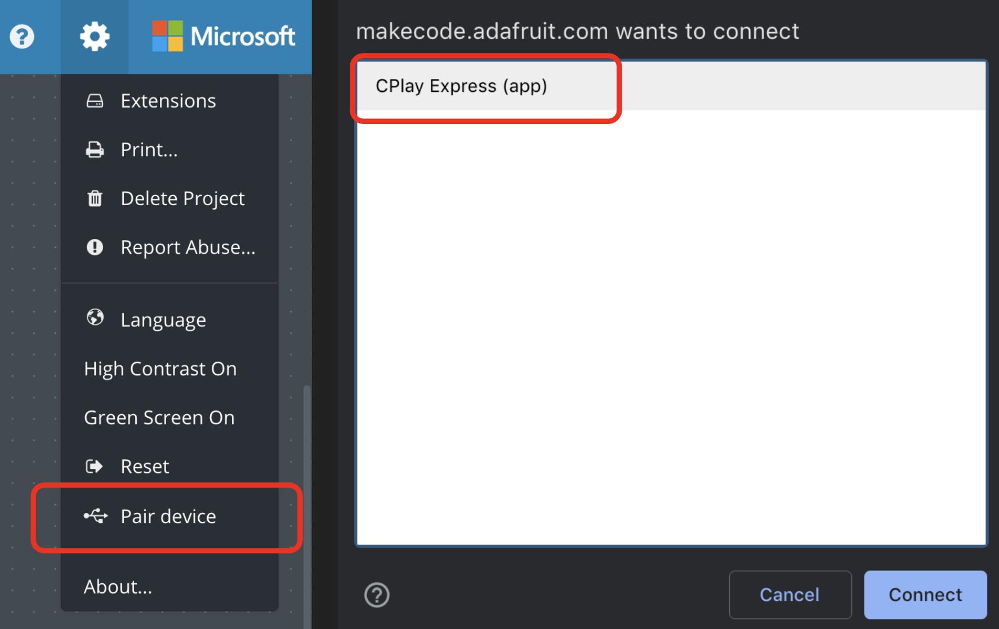
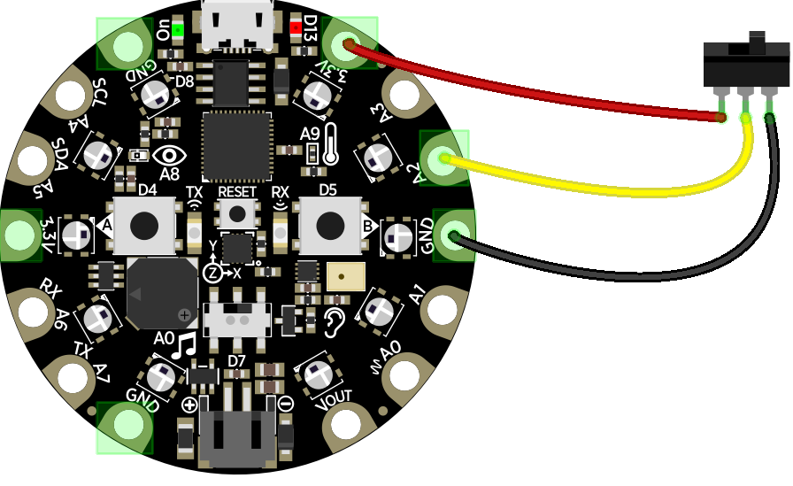
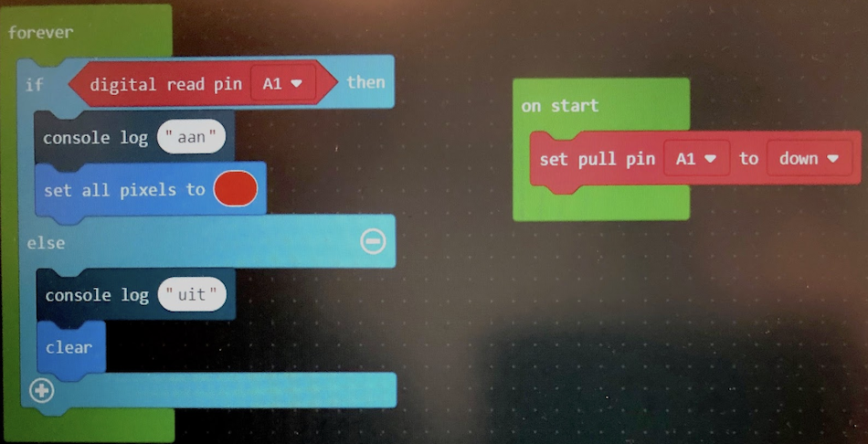
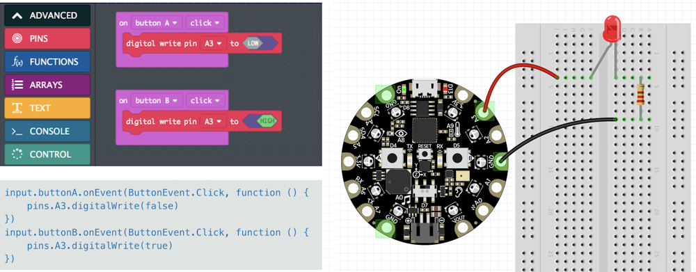
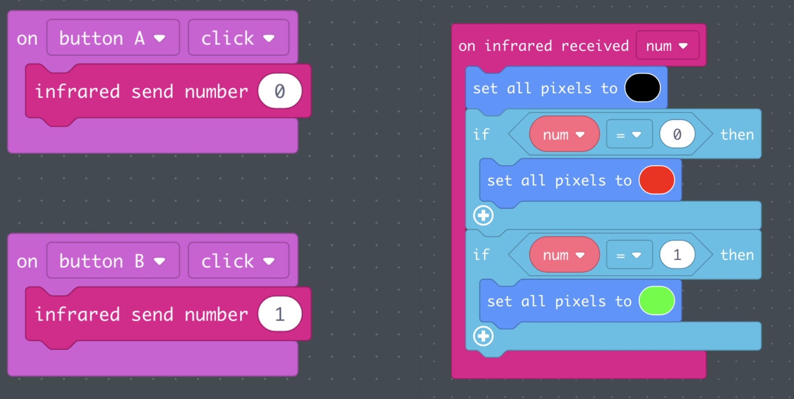
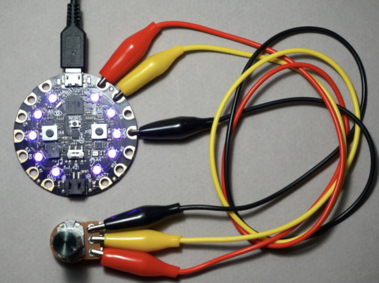
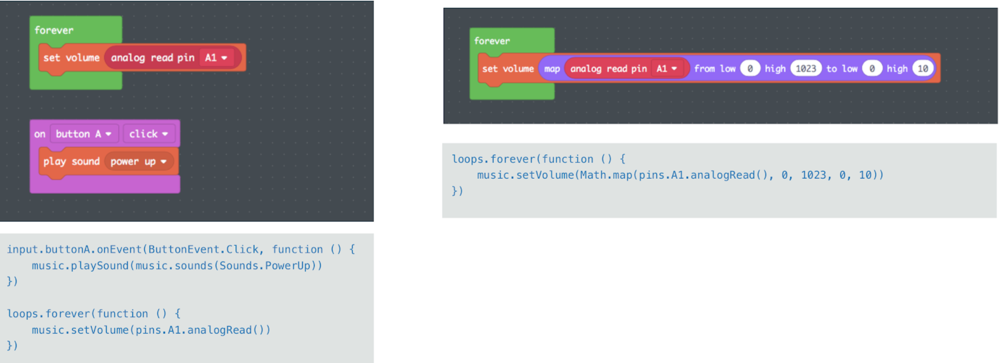
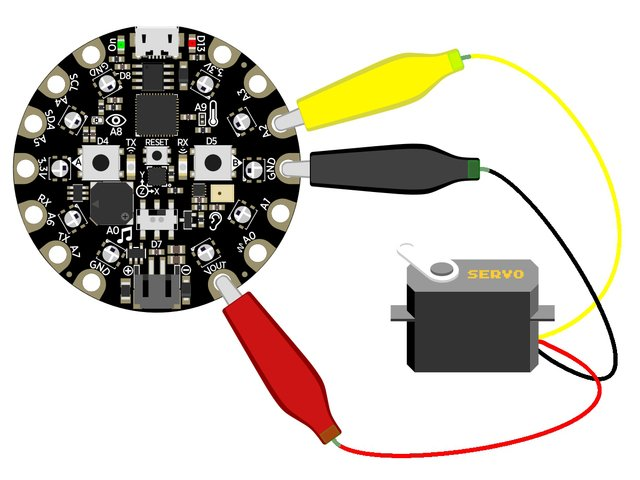

# Circuit Playground Connections

Some tips and ideas to connect external hardware to your CPE!

- Display Sensor Values
- On/Off Button
- External LED
- Infrared communication
- Rotating Button
- DC Motor

## Display Sensor Values

Use USB pairing in Chrome to display sensor values from the CPE in the browser.

## ON/OFF Switch - 3 pins

The 3 pin switch will send power to GND or to the A2 pin, depending on the position.

## ON/OFF Button - 2 pins

Put power from 3.3V or VOUT on one of the pins. Connect the other pin to an input port to read if there is power or not. Do not forget to "pull down" the input pin, to avoid random results.

## External LED

Connect GND to the short wire of the LED and A2 to the long wire. Make sure there is a small resistor (220Ohm or 330Ohm) in the ciruit.

## Infrared communication

You can use infrared to send signals from one CPE to another CPE!

## Rotating button

Connect 3.3V and GND to the outer pins. Connect A2 to the middle pin. Use code to read the the value of A2. This will be a number between 0 and 1024. You can use the **map** function to convert this to values that you need.

## DC Motor

The DC Motor can be used for driving wheels. Use the CLEVER Mosfet to safely control a DC motor. Use the **VOUT** to get 5 Volt from the CPE. 

## Servo 

The servo is used for limited but precise movement. Most servos rotate a maximum of 360 degrees.

