# Circuit Playground Connections

Enkele tips en ideeën om externe hardware aan te sluiten op je CPE!

- [Circuits](#circuit)
- [External pins](#analog)
- [Resistors](#resistors)
- [Breadboards](#breadboards)
- [External LED](#led)
- [Push Button](#pushbutton)
- [External power for Playground](#power)
- [How to check sensor values](#values)
- [External Switch 3 pins](#switch)
- [External Button 2 pins](#button)
- [Force sensor](#button)
- [Infrared communication](#infrared)
- [Rotating Button](#potentio)
- [Solid Core Wire](#solidwire)
- [Servo](#servo)
- [Servo with external power](#external)
- [Distance Sensor](#distance)
- [Neopixel Strip](#neopixel)
- [DC Motors](#dcmotor)
- [Solenoid (push/pull)](#solenoid)
- [Relais](#relais)
- [Other parts](#parts)
- [Where to buy](#shopping)

<br>
<br>
<br>

---

## <a name="circuit"></a>Circuits

Je kan externe circuits maken vanaf de Playground Express met behulp van de external pins. Je kan stroom rechtstreeks halen van de 3.3V pin, of je kan stroom naar de andere pins sturen met behulp van code.
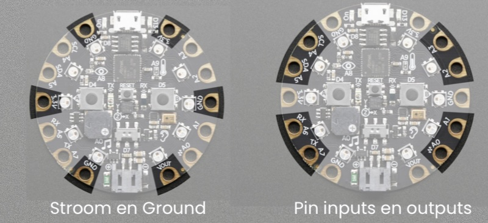

- [Bekijk hier alle external pins](https://learn.adafruit.com/adafruit-circuit-playground-express/pinouts)

### Digital values

Voor de meeste pins kan je de stroom op HIGH of LOW zetten, dit betekent dat er 3 Volt op de pin staat of 0 Volt. Je kan dit instellen met `digital write`. Je kan ook *lezen* of er stroom op een pin staat, met behulp van `digital read`.

### Analog values

Sommige pins staan toe om een waarde tussen 0 en 1023 in te stellen. Dit betekent dat er meer of minder stroom naar de pin gaat. Dit bepaalt bijvoorbeeld hoe snel een motor gaat. Je kan `analog read` gebruiken op een pin, om de waarde van een externe input te lezen, dit gebruik je bv. voor een draaiknop.

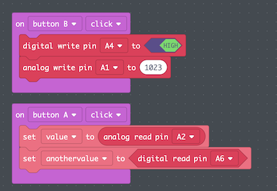


<br>
<br>
<br>

---

## <a name="resistors"></a>Resistors

Als je Power rechtstreeks verbindt met Ground, krijg je kortsluiting ⚡️⚡️⚡️. Een **RESISTOR** voorkomt kortsluiting door de stroom te vertragen.

Een LED heeft bijna geen weerstand, daarom gebruiken we een resistor om beschadiging aan de LED of de batterij te voorkomen. Grotere resistors zullen de stroom meer vertragen! In dit voorbeeld zal de LED minder fel branden als je de resistor vergroot. 

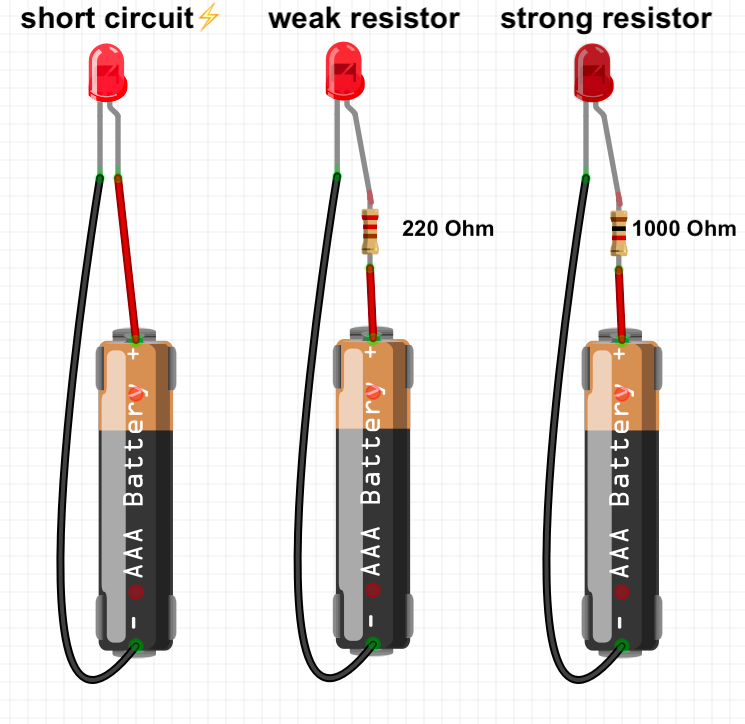

- [Resistor codes](http://www.resistor-calculator.com)
 
## <a name="breadboards"></a>Breadboards

Een breadboard biedt een makkelijke manier om veel kleine componenten met elkaar te verbinden zonder te solderen.

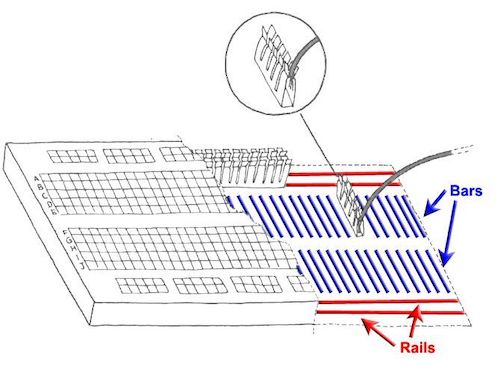

- [📺  How to use a breadboard](https://www.youtube.com/watch?v=6WReFkfrUIk)

<br>
<br>
<br>

---

## <a name="led"></a>External LED

Je kan een breadboard gebruiken om externe electronica makkelijk aan te sluiten aan de playground. Gebruik een LED en een 220 Ohm weerstand. De weerstand zorgt dat je lampje niet beschadigt. 

Let op dat het lange pootje van de LED naar de stroom gaat, en het korte pootje gaat naar GND. De weerstand mag wel aan beide kanten zitten.

Test of het lampje gaat branden door de rode draad rechtstreeks op de stroom (3.3V) van de playground aan te sluiten. De zwarte draad gaat naar GND.

Als dat werkt sluit je de rode draad aan op de A2 poort van de playground. Hier kan je met code stroom op zetten.


Als je meerdere LEDS wil aansturen kan je ze allemaal aan een eigen poort aansluiten. Ze kunnen wel de GND delen. Gebruik daarvoor het lange gootje van de breadboard.

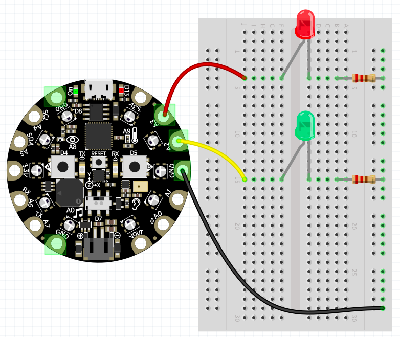

<br>
<br>
<br>

---

## <a name="pushbutton"></a>Pushbutton

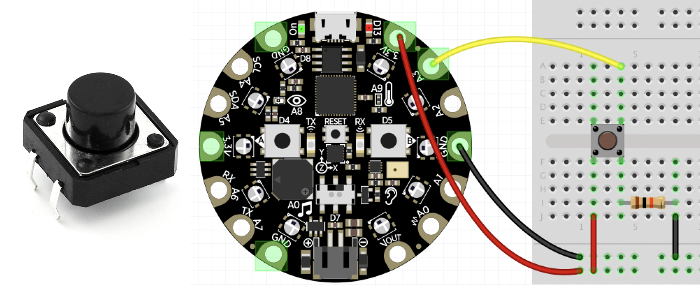

De push button is gewoon een manier om stroom door een draad te laten gaan, of de stroom te blokkeren. Als de button wordt ingedrukt, mag de stroom door naar de draad die naar A3 leidt. Je kan dan het `digitalRead()` commando gebruiken om te detecteren of de draad stroom heeft.

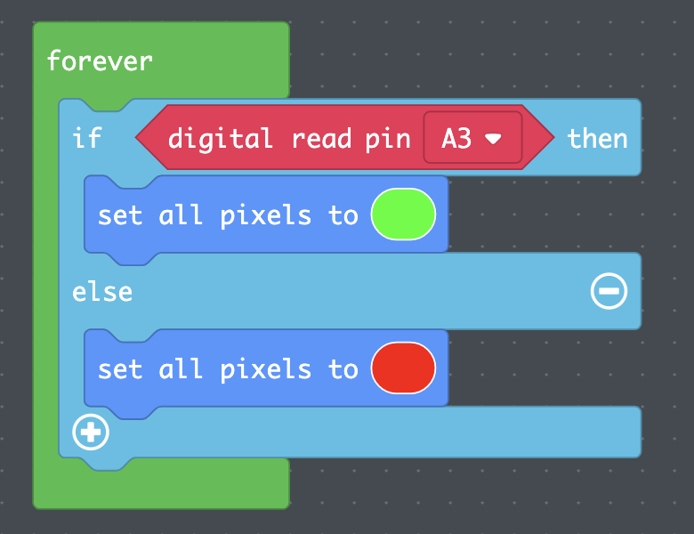

```javascript
forever(function () {
    if (pins.A3.digitalRead()) {
        light.setAll(0x00ff00)
    } else {
        light.setAll(0xff0000)
    }
})
```

<br>
<br>
<br>

---

## <a name="power"></a>External power for playground

De playground express heeft een poort voor een externe batterij. Als je een oplaadbare **Lithium Polymer** batterij gebruikt, zal deze opladen als de playground verbonden is met USB. De batterijen zijn **3.7 Volt**. De hoeveelheid **mAh** *(milli Ampere per uur)* bepaalt hoe lang de batterij meegaat. Kleinere batterijen hebben minder mAh.

> LET OP: dit geeft geen stroom aan de [crickit](../crickit/readme.md)! Als je een crickit hebt aangesloten, moet je de externe stroom van de crickit gebruiken.

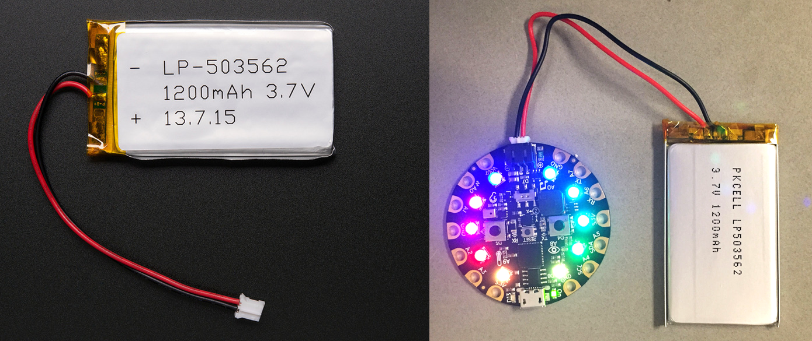

- [Adafruit Explanation of LiPoly batteries](https://learn.adafruit.com/circuit-playground-lesson-number-0/battery-jack-supply)
- [Lithium Polymer Battery at KIWI electronics](https://www.kiwi-electronics.nl/lithium-ion-polymer-battery-3-7v-1200mAh?search=lipoly&description=true)

<br>
<br>
<br>

---

## <a name="values"></a>How to check sensor values

Gebruik USB pairing in Chrome om sensor waardes van de CPE in de browser weer te geven.


<br>
<br>
<br>

---

## <a name="switch"></a>External Switch 3 pins

Zet 3.3V op de eerste pin. De positie van de switch zal stroom sturen naar de GND of naar de A2 pin, afhankelijk van de positie.


Gebruik `digitalRead()` om te zien of de switch in positie 0 of 1 staat.

```javascript
let switchValue = pins.A2.digitalRead()
```
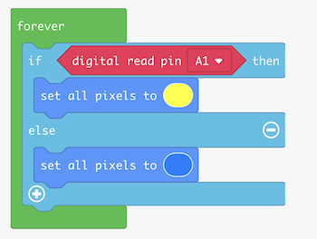

---
<br>
<br>
<br>

## <a name="button"></a>External Button 2 pins

Zet stroom van 3.3V of VOUT op een van de pins. Verbind de andere pin met een input poort om te lezen of er stroom is of niet. Vergeet niet om de input pin "pull down" te zetten, om willekeurige resultaten te voorkomen.


<br>
<br>
<br>

---

## <a name="force"></a>Force sensor

De force sensor meet hoe hard je op de plaat duwt. Gebruik een grote resistor (10K Ohm). Verbind de gele draad met een analog poort zoals A1, en dan kan je de waarde op de poort lezen.

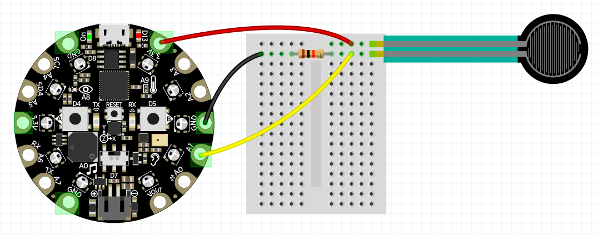
```javascript
let force = pins.A1.analogRead()
console.log(`The force is ${force}`)
```
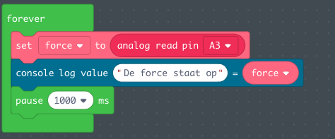

<br>
<br>
<br>

---

## <a name="infrared"></a>Infrared communication

Je kan infrared gebruiken om signalen van de ene CPE naar de andere CPE te sturen!


<br>
<br>
<br>

---

## <a name="potentio"></a>Rotating button (potentiometer)

Verbind de playground 3.3V en GND pads met de buitenste pins van de potentiometer. Verbind de playground A3 pad met de middelste pin van de potentiometer. Nu, je kan de waarde van A3 lezen door het **Analog read A3** block te gebruiken. Dit zou een getal van 0 tot 1024 moeten zijn.

Als je je playground PAIRT in Chrome, kan je de waarde van A3 in de console laten zien. Op deze manier kan je controleren of je echt een getal tussen 0 en 1024 krijgt. Je kan de **map** functie gebruiken om dit getal om te zetten naar elke waarde die je nodig hebt. In deze voorbeeldcode gaan de lampjes van 0 tot 9 aan door aan de knop te draaien. [Makecode voorbeeld.](https://makecode.com/_csHRjdVVUD7A)


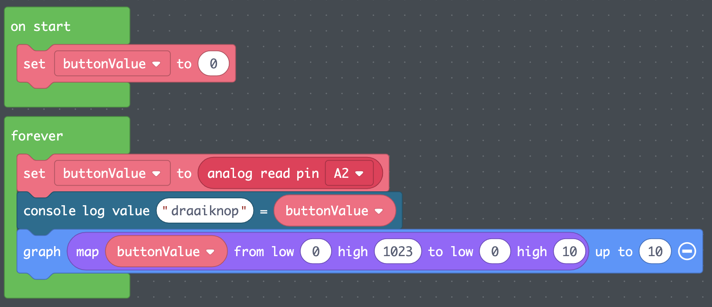


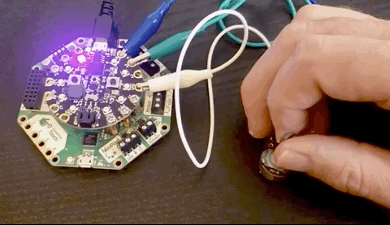

```javascript
let buttonValue = 0

forever(function () {
    buttonValue = pins.A2.analogRead()
    console.logValue("draaiknop", buttonValue)
    light.graph(Math.map(buttonValue, 0, 1023, 0, 10), 10)
})

```

<br>
<br>
<br>

---

## <a name="solidwire"></a>Solid Core Wire

Met een rolletje [*solid core wire*](https://www.youtube.com/watch?v=ver-Av8vr1Q) kan je een steviger prototype bouwen op je breadboard.


- [Solid Core Wire bestellen bij Kiwi Electronics](https://www.kiwi-electronics.nl/en/search?search=solid%20core%20wire)

<br>
<br>
<br>

---

## <a name="servo"></a>Servo 

De servo wordt gebruikt voor beperkte maar precieze beweging. De meeste servo's draaien maximaal 360 graden.


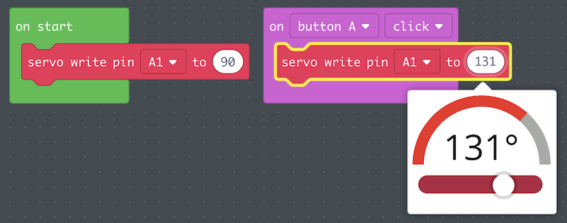

<br>
<br>
<br>

---


## <a name="external"></a>Servo with external Power

Als je servo te veel stroom verbruikt, of als je meerdere servo's nodig hebt, kan je je servo aansluiten op een externe stroombron. Zorg ervoor dat de **GND** van de servo zowel verbonden is met de Playground als met de ground van de externe stroom.

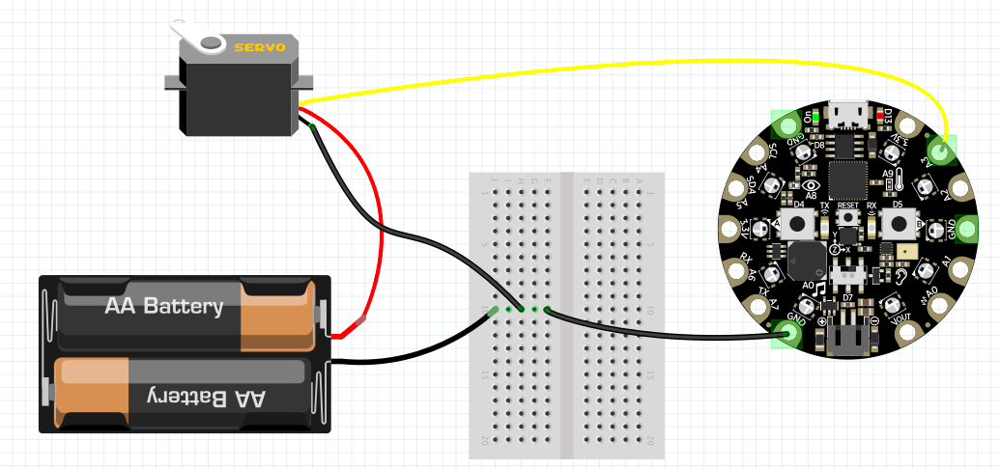

---
<br>
<br>

## <a name="distance"></a>Distance sensor

Gebruik een **3 Volt RCW0001** ultrasonic distance sensor om afstanden te meten met de Playground Express. 

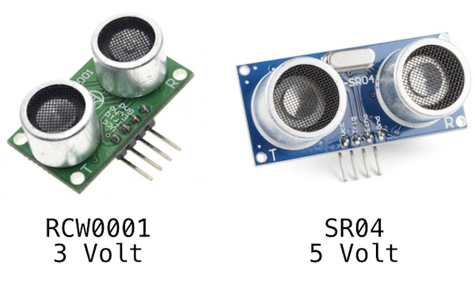

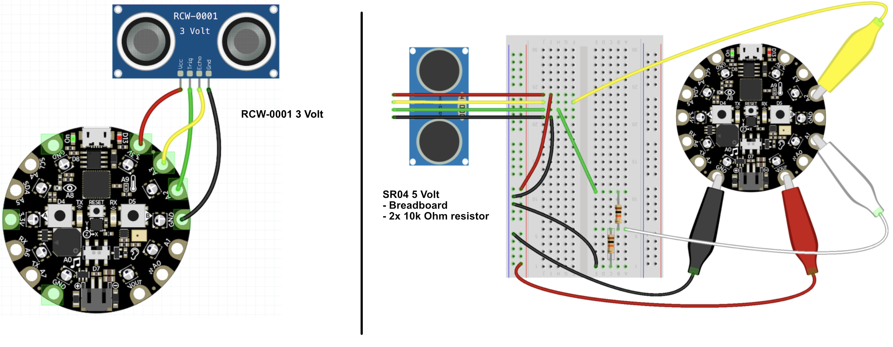

- Sluit VCC aan op stroom
- Sluit GND aan op GND 
- Sluit de TRIG aan op A3
- Sluit de ECHO aan op A2

⚠️ De SR04 is **5 Volt**, dat moet je [eerst geschikt maken voor **3 Volt**](https://learn.adafruit.com/distance-measurement-ultrasound-hcsr04)

De afstand sensor werkt door een geluid te sturen over de linker speaker, en dan met de rechter speaker te meten hoe lang het duurt voordat de echo terug komt. 

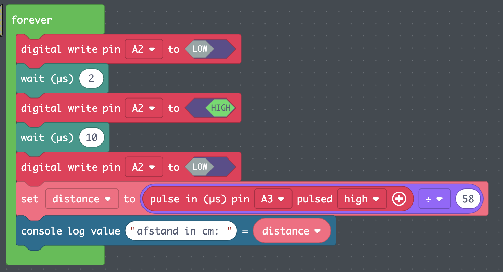

[Voorbeeld in MakeCode](https://makecode.com/_a8M8fMhfE1Tp)

> Het inlezen van de pulse is niet beschikbaar in de **crickit** blocks, dus de sensor is aangesloten op de playground.

- [3 Volt RCW-0001 afstand sensor bij TinyTronics](https://www.tinytronics.nl/shop/en/sensors/distance/ultrasonic-sensor-rcw-0001)
- [3 Volt RCWL-1601 afstand sensor](https://www.adafruit.com/product/4007)
<!-- - [5 Volt SR04 distance sensor](https://www.kiwi-electronics.nl/ultrasonic-sensor-hc-sr04?lang=en) -->
- [5 Volt distance sensor](https://learn.adafruit.com/distance-measurement-ultrasound-hcsr04?view=all)


<br>
<br>
<br>

---

## <a name="neopixel"></a>Neopixel strip

Je kan externe Neopixel (RGB LED) strips aansluiten op de Circuit Playground.

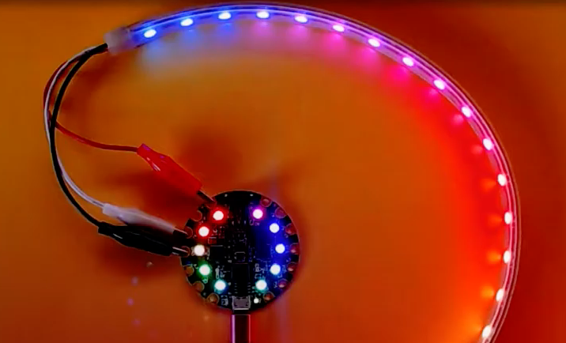

Het CPE board kan slechts een beperkt aantal Neopixels van stroom voorzien. Om het stroomverbruik te verminderen kan je:

- De helderheid verlagen
- Niet alle leds tegelijk laten branden
- Enkele kleuren gebruiken in plaats van volledig wit

Als je dit niet kan doen of VEEL neopixels wil gebruiken, kan je een externe stroombron gebruiken, bijvoorbeeld een 5V 2Amp adapter. Wees voorzichtig bij het aansluiten van alles! 2Amps kan je board of neopixels beschadigen.

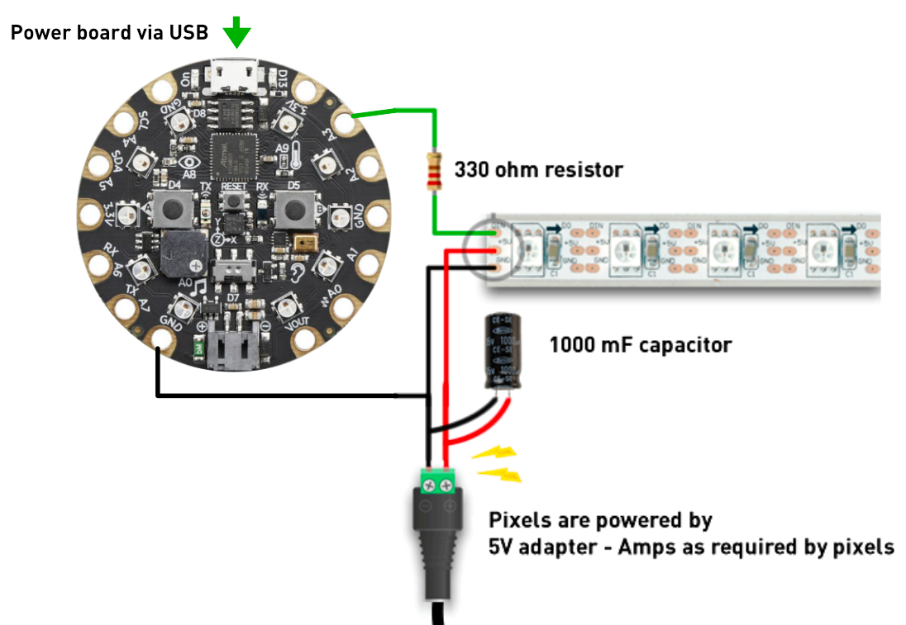

- [Adafruit makecode neopixel documentation](https://learn.adafruit.com/neopixels-with-makecode?view=all)
- [📺 MakeCode Example](https://www.youtube.com/watch?v=HnmjztjSqIo) and more [types of connections](https://www.youtube.com/watch?v=vCDfyxNFeEw)
- [Power usage explanation](http://www.eerkmans.nl/powering-lots-of-leds-from-arduino/)

<br>
<br>
<br>

---

## <a name="dcmotor"></a>DC Motor

De DC Motor kan gebruikt worden voor wielen en andere continue beweging.
Om zware objecten te bewegen heb je een **Geared DC motor** nodig. De gears zijn nodig om snelle beweging om te zetten naar sterke beweging.

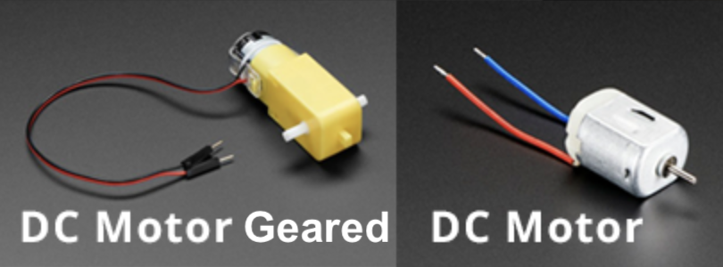

DC Motors gebruiken te veel stroom voor de Circuit Playground. Je kan dit oplossen door [de **Adafruit Crickit** te gebruiken](../crickit/readme.md). De Crickit stelt je in staat om twee motors afzonderlijk te besturen. 

Je kan ook [dc motors aansluiten op hun eigen stroombron met een relais](#relais). Het relais stelt je in staat om meer dan twee motors aan te sluiten. 

Het [mosfet](./mosfet.md) is een andere manier om een DC motor aan te sluiten op een playground.


---
<br>
<br>

## <a name="solenoid"></a>Solenoid (push/pull)

Met een solenoid kan je een horizontale of verticale beweging maken. Deze solenoid is 5 Volt en kan je aansluiten op de **Motor drive van de Crickit**. (Sluit de solenoid niet rechtstreeks aan op de Playground!)


```typescript
forever(function () {
    crickit.drive1.analogWrite(1023)
    pause(100)
    crickit.drive1.analogWrite(0)
    pause(500)
})
```

- [📺 Solenoid MakeCode instruction video](https://www.youtube.com/watch?v=AMvSTm0cWyA)
- [Robotshop Solenoid](https://www.robotshop.com/nl/nl/5v-solenoid.html)

<br>
<br>

## <a name="#relais"></a>Relais

Met een **relais** kan je een extern circuit **aan / uit** zetten via de playground express. Dit kan handig zijn als je meer dan 3 ~ 5 Volt nodig hebt voor je externe apparaten. 

Met de code `digitalWrite()` kan je het relais laten schakelen tussen AAN en UIT.

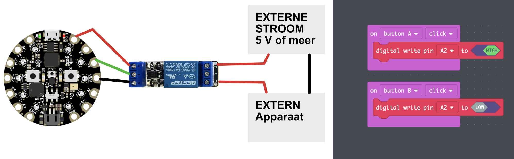

In het volgende voorbeeld zie je een 9 Volt batterij waar 3 DC motoren op zijn aangesloten. De stroom die naar de 3 motoren gaat, kan je aan en uit zetten via het [relais](https://www.benselectronics.nl/1-kanaals-relais-board-3v.html).

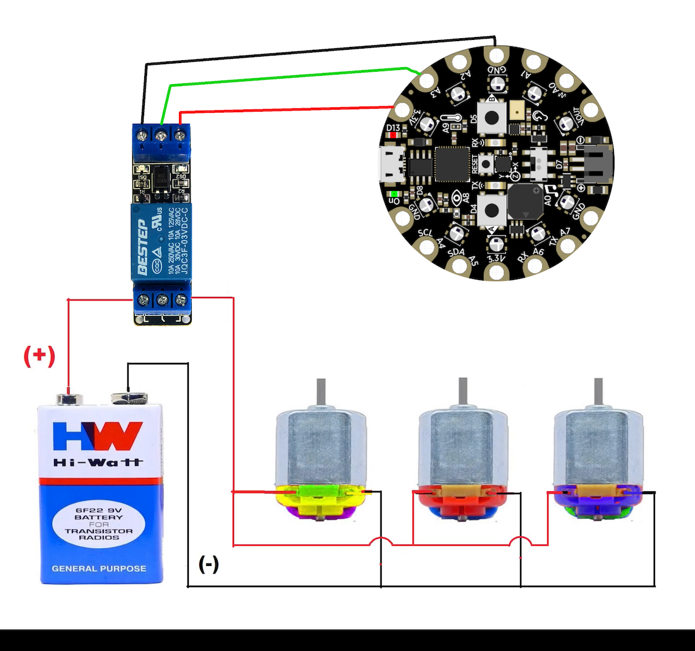

> ⚠️ Let op dat je geen hoge voltages aansluit (*geen 220 Volt!!*). Je kan jezelf ernstig bezeren. Hou het bij lage voltages (~3 tot ~12 volt) en apparaten die daarvoor bedoeld zijn.

<br>

- [3 Volt Relais kopen](https://www.benselectronics.nl/1-kanaals-relais-board-3v.html)
- [📺 aansluiten van meerdere DC motoren aan batterij](https://www.youtube.com/watch?v=aV8clSDuwm8).


---
<br>
<br>

## <a name="parts"></a>Other parts

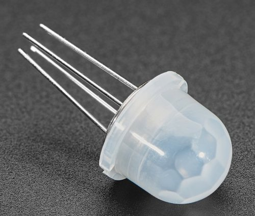

- [Lichtgevend draad 🤯](https://learn.adafruit.com/el-wire)
- [Mini Infrared Motion Detector (PIR) for 3V](https://www.adafruit.com/product/4666)
- [On Off Switch](https://www.kiwi-electronics.nl/nl/aan-uit-tuimelschakelaar-rood-3630)
- [Force sensor](https://www.kiwi-electronics.nl/ronde-drukgevoelige-weerstand-fsr402?lang=en)
- [Air quality sensor](https://www.kiwi-electronics.nl/sensoren/adafruit-sgp30-air-quality-sensor-breakout)
- [Human Presence Sensor](https://www.antratek.nl/24ghz-mmwave-radar-sensor-human-static-presence-module)
- [Soil Moisture sensor](https://www.kiwi-electronics.nl/sparkfun-soil-moisture-sensor?search=moisture%20sensor&description=true)
- [🤖 Mini Pan and Tilt robot arm!](https://www.adafruit.com/product/1967)
- [⚙️ Geared DC Motor](https://www.kiwi-electronics.nl/hobby-dc-motor-140rpm-2-stuks?search=dc%20motor&description=true)

---
<br>
<br>

## <a name="shopping"></a>Shopping

- [Kiwi electronics](https://www.kiwi-electronics.nl)
- [Antratek](https://www.antratek.nl/)
- [Tinytronics](https://www.tinytronics.nl/shop/nl)
- [Ben's Electronics](https://www.benselectronics.nl)
- [Elektronica voor jou](https://elektronicavoorjou.nl)
