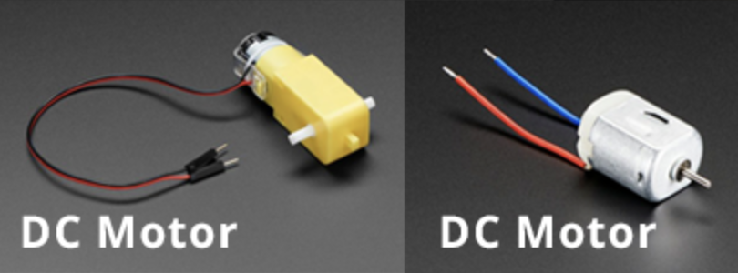
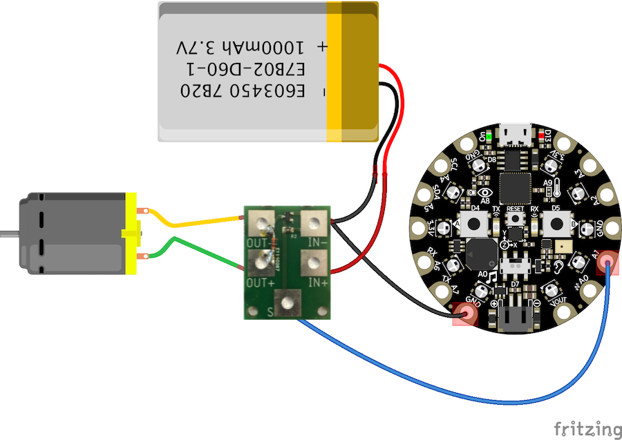

# Circuit Playground Connections

Some tips and ideas to connect external hardware to your CPE!

- Display Sensor Values
- On/Off Button
- External LED
- Infrared communication
- Rotating Button
- DC Motor
- Neopixel Strip

## Display Sensor Values

Use USB pairing in Chrome to display sensor values from the CPE in the browser.

## ON/OFF Switch - 3 pins

Put 3.3V on the first pin. The position of the switch will send power to the GND or to the A2 pin, depending on the position.

## ON/OFF Button - 2 pins

Put power from 3.3V or VOUT on one of the pins. Connect the other pin to an input port to read if there is power or not. Do not forget to "pull down" the input pin, to avoid random results.

## External LED

Connect GND to the short wire of the LED and A2 to the long wire. Make sure there is a small resistor (220Ohm or 330Ohm) in the ciruit.

## Infrared communication

You can use infrared to send signals from one CPE to another CPE!

## Rotating button

Connect 3.3V and GND to the outer pins. Connect A2 to the middle pin. Use code to read the the value of A2. This will be a number between 0 and 1024. You can use the **map** function to convert this to values that you need.

## Servo 

The servo is used for limited but precise movement. Most servos rotate a maximum of 360 degrees.

## Neopixel strip

You can connect external Neopixel (RGB LED) strips to the Circuit Playground.

- [Code Examples](https://learn.adafruit.com/neopixels-with-makecode?view=all)
- [MakeCode Example](https://www.youtube.com/watch?v=HnmjztjSqIo)
- [Different types of connections](https://www.youtube.com/watch?v=vCDfyxNFeEw)

If you connect a LOT of neopixels at the same time, you have to be careful with powering them.

- Reduce the brightness
- Don't light up all leds at the same time
- Full white uses the most power

To prevent power problems, you can use an external power source. In this example, the Playground is only used to send data to the Neopixel strip. The strip has its own power source, for example, a 5V 2Amp adapter from a mobile phone.

## DC Motor

The DC Motor can be used for wheels and other continuous motion.

DC Motors use too much power for the Circuit Playground. The easiest solution for this is to connect an Adafruit Crickit to the Playground. [Follow this Crickit tutorial](../crickit/readme.md)!

Without a Crickit, you can use a MOSFET to safely connect external power to the motors:

### MOSFET

Use the **CLEVER Mosfet** to safely control a DC motor.

| Pin  | Connection                                                 |
|------|------------------------------------------------------------|
| OUT- | GND of the DC Motor                                        |
| OUT+ | PLUS of the DC Motor                                       |
| IN-  | GND of the battery AND the GND of the Circuit Playground   |
| IN+  | PLUS of the battery, OR the VOUT of the Circuit Playground |
| S    | Connect to playground pin **A1 - A5** to send a PWM signal to the Motor    |

This example uses the **VOUT** to get 5 Volt from the CPE. Do **not** use the 3.3V port!

It's safer to use an external battery to drive the motor. Just make sure the GND of the battery and the Playground are connected.
