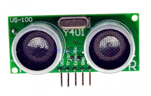
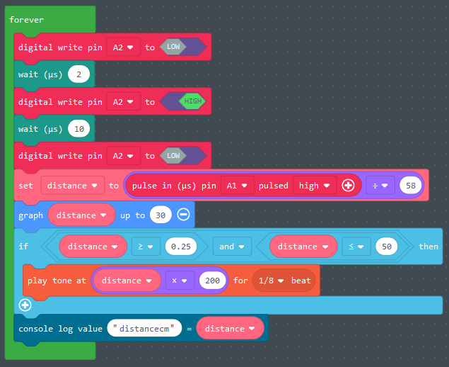

# Circuit Playground Connections

Some tips and ideas to connect external hardware to your CPE!

- [Resistors](#resistors)
- [Breadboards](#breadboards)
- [External LED](#led)
- [How to check sensor values](#values)
- [External Switch 3 pins](#switch)
- [External Button 2 pins](#button)
- [Force sensor](#button)
- [Infrared communication](#infrared)
- [Rotating Button](#potentio)
- [Servo](#servo)
- [Distance Sensor](#distance)
- [Neopixel Strip](#neopixel)
- [DC Motors](#dcmotor)
- [Other parts](#parts)
- [Where to buy](#shopping)

<br>
<br>
<br>

---

## <a name="resistors"></a>Resistors

If you connect Power directly to Ground, you get a short circuit ⚡️⚡️⚡️ . A **RESISTOR** prevents short circuits by slowing down the flow of power. 

A LED has almost no resistance by itself, that's why we use a resistor to prevent damage to the LED or the battery. Larger resistors will slow down the flow of power more! In this example, the LED will burn less bright, if you increase the resistor. 


- [Resistor codes](http://www.resistor-calculator.com)
 
## <a name="breadboards"></a>Breadboards

A breadboard provides an easy way to connect lots of tiny components together without soldering.


- [📺  How to use a breadboard](https://www.youtube.com/watch?v=6WReFkfrUIk)

<br>
<br>
<br>

---

## <a name="led"></a>External LED

Je kan een breadboard gebruiken om externe electronica makkelijk aan te sluiten aan de playground. Gebruik een LED en een 220 Ohm weerstand. De weerstand zorgt dat je lampje niet beschadigt. 

Let op dat het lange pootje van de LED naar de stroom gaat, en het korte pootje gaat naar GND. De weerstand mag wel aan beide kanten zitten.


Als je meerdere LEDS wil aansturen kan je ze allemaal aan een eigen poort aansluiten. Ze kunnen wel de GND delen. Gebruik daarvoor het lange gootje van de breadboard.


<br>
<br>
<br>

---

## <a name="values"></a>How to check sensor values

Use USB pairing in Chrome to display sensor values from the CPE in the browser.


<br>
<br>
<br>

---

## <a name="switch"></a>External Switch 3 pins

Put 3.3V on the first pin. The position of the switch will send power to the GND or to the A2 pin, depending on the position.


Gebruik `digitalRead()` om te zien of de switch in positie 0 of 1 staat.

```javascript
let switchValue = pins.A2.digitalRead()
```


---
<br>
<br>
<br>

## <a name="button"></a>External Button 2 pins

Put power from 3.3V or VOUT on one of the pins. Connect the other pin to an input port to read if there is power or not. Do not forget to "pull down" the input pin, to avoid random results.


<br>
<br>
<br>

---

## <a name="force"></a>Force sensor

The force sensor measures how hard you push on the plate. Use a large resistor (10K Ohm). Connect the yellow wire to an analog port such as A1, and then you can read the value on the port

```javascript
let force = pins.A1.analogRead()
console.log(`The force is ${force}`)
```


<br>
<br>
<br>

---

## <a name="infrared"></a>Infrared communication

You can use infrared to send signals from one CPE to another CPE!


<br>
<br>
<br>

---

## <a name="potentio"></a>Rotating button (potentiometer)

Connect the playground 3.3V and GND pads to the outer pins of the potentiometer. Connect the playground A3 pad to the middle pin of the potentiometer. Now, you can read the value of A3 by using the **Analog read A3** block. This should be a number from 0 to 1024.

If you PAIR your playground in Chrome, you can show the value of the of A3 in the console. This way you can check if you really get a number between 0 and 1024. You can use the **map** function to convert this number to any value that you need. In this example code, the lights from 0 to 9 turn on by turning the knob. [Makecode example.](https://makecode.com/_csHRjdVVUD7A)


<br>
<br>
<br>

---

## <a name="servo"></a>Servo 

The servo is used for limited but precise movement. Most servos rotate a maximum of 360 degrees.


<br>
<br>
<br>

---

## <a name="distance"></a>Distance sensor

Gebruik een ultrasnoic distance sensor om afstanden te meten met de Playground Express. 



- Sluit VCC aan op 3.3Volt
- Sluit GND aan op GND
- Sluit de TRIG aan op A1
- Sluit de ECHO aan op A2

De afstand sensor werkt door een geluid te sturen over de linker speaker, en dan met de rechter speaker te meten hoe lang het duurt voordat de echo terug komt. Deze code laat zien hoe je dat doet. Let op, het inlezen van de pulse is niet beschikbaar in de **crickit** blocks, dus de sensor zit aangesloten aan de playground.



**Let op** er zijn veel verschillende typen distance sensor. De meest gangbare is de SR04. Deze is 5 Volt, dus dat voltage moet je omzetten naar 3 Volt. [Hier vind je een uitleg van de SR04 sensor aansluiting voor de circuit playground express](https://learn.adafruit.com/distance-measurement-ultrasound-hcsr04)

- [SR04 5V distance sensor](https://www.kiwi-electronics.nl/ultrasonic-sensor-hc-sr04?lang=en)

Er bestaan ook 3 Volt distance sensoren:

- [3 Volt RCW0001 afstand sensor bij TinyTronics](https://www.tinytronics.nl/shop/en/sensors/distance/ultrasonic-sensor-rcw-0001)
- [3 Volt US100 afstand sensor kopen bij TinyTronics](https://www.tinytronics.nl/shop/en/sensors/distance/ultrasonic-sensor-us-100-uart-with-temperature-sensor)
- [Adafruit 3 Volt afstand sensor](https://www.adafruit.com/product/4007)


<br>
<br>
<br>

---

## <a name="neopixel"></a>Neopixel strip

You can connect external Neopixel (RGB LED) strips to the Circuit Playground.


The CPE board can only power a limited amount of Neopixels. To reduce power usage you can:

- Reduce the brightness
- Don't light up all leds at the same time
- Use single colors instead of full white

If you can't do this or want to use LOTS of neopixels, you can use an external power source, for example a 5V 2Amp adapter. Be careful when connecting everything! 2Amps can damage your board or neopixels.


- [Adafruit makecode neopixel documentation](https://learn.adafruit.com/neopixels-with-makecode?view=all)
- [📺 MakeCode Example](https://www.youtube.com/watch?v=HnmjztjSqIo) and more [types of connections](https://www.youtube.com/watch?v=vCDfyxNFeEw)
- [Power usage explanation](http://www.eerkmans.nl/powering-lots-of-leds-from-arduino/)

<br>
<br>
<br>

---

## <a name="dcmotor"></a>DC Motor

The DC Motor can be used for wheels and other continuous motion.


DC Motors use too much power for the Circuit Playground. [The easiest solution for this is to connect an Adafruit Crickit to the Playground](../crickit/readme.md)!

If you don't have a CRICKIT [you can use the **CLEVER Mosfet** to safely control a DC motor](./mosfet.md)


---
<br>
<br>

## <a name="parts"></a>Other parts


- [Mini Infrared Motion Detector (PIR) for 3V](https://www.adafruit.com/product/4666)
- [Force sensor](https://www.kiwi-electronics.nl/ronde-drukgevoelige-weerstand-fsr402?lang=en)
- [Mini Pan and Tilt kit](https://www.adafruit.com/product/1967)

---
<br>
<br>

## <a name="shopping"></a>Shopping

- [Kiwi electronics](https://www.kiwi-electronics.nl)
- [FLORIS](https://www.floris.cc)
- [Antratek](https://www.antratek.nl/)
- [Tinytronics](https://www.tinytronics.nl/shop/nl)
