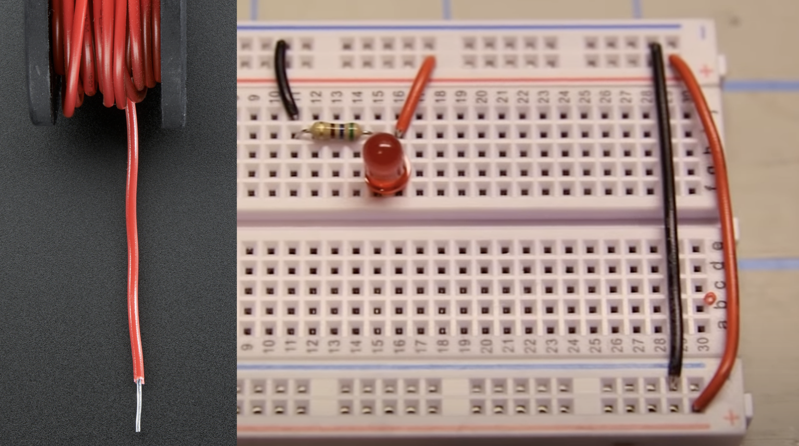

# Circuit Playground Connections

Some tips and ideas to connect external hardware to your CPE!

- [Resistors](#resistors)
- [Breadboards](#breadboards)
- [External LED](#led)
- [Push Button](#pushbutton)
- [External power for Playground](#power)
- [How to check sensor values](#values)
- [External Switch 3 pins](#switch)
- [External Button 2 pins](#button)
- [Force sensor](#button)
- [Infrared communication](#infrared)
- [Rotating Button](#potentio)
- [Solid Wire]("#solidwire")
- [Servo](#servo)
- [Servo with external power](#external)
- [Distance Sensor](#distance)
- [Neopixel Strip](#neopixel)
- [DC Motors](#dcmotor)
- [Solenoid (push/pull)](#solenoid)
- [Other parts](#parts)
- [Where to buy](#shopping)

<br>
<br>
<br>

---

## <a name="resistors"></a>Resistors

If you connect Power directly to Ground, you get a short circuit ⚡️⚡️⚡️ . A **RESISTOR** prevents short circuits by slowing down the flow of power. 

A LED has almost no resistance by itself, that's why we use a resistor to prevent damage to the LED or the battery. Larger resistors will slow down the flow of power more! In this example, the LED will burn less bright, if you increase the resistor. 


- [Resistor codes](http://www.resistor-calculator.com)
 
## <a name="breadboards"></a>Breadboards

A breadboard provides an easy way to connect lots of tiny components together without soldering.


- [📺  How to use a breadboard](https://www.youtube.com/watch?v=6WReFkfrUIk)

<br>
<br>
<br>

---

## <a name="led"></a>External LED

Je kan een breadboard gebruiken om externe electronica makkelijk aan te sluiten aan de playground. Gebruik een LED en een 220 Ohm weerstand. De weerstand zorgt dat je lampje niet beschadigt. 

Let op dat het lange pootje van de LED naar de stroom gaat, en het korte pootje gaat naar GND. De weerstand mag wel aan beide kanten zitten.

Test of het lampje gaat branden door de rode draad rechtstreeks op de stroom (3.3V) van de playground aan te sluiten. De zwarte draad gaat naar GND>

Als dat werkt sluit je de rode draad aan op de A2 poort van de playground. Hier kan je met code stroom op zetten.


Als je meerdere LEDS wil aansturen kan je ze allemaal aan een eigen poort aansluiten. Ze kunnen wel de GND delen. Gebruik daarvoor het lange gootje van de breadboard.


<br>
<br>
<br>

---

## <a name="pushbutton"></a>Pushbutton


The push button is just a way to send power through a wire, or block the power. When the button is pushed, power is allowed through to the wire that leads to A3. You can then use the `digitalRead()` command to detect if the wire is powered.


```javascript
forever(function () {
    if (pins.A3.digitalRead()) {
        light.setAll(0x00ff00)
    } else {
        light.setAll(0xff0000)
    }
})
```

<br>
<br>
<br>

---

## <a name="power"></a>External power for playground

The playground express has a port for an external battery. If you use a rechargable **Lithium Polymer** battery, it will recharge if the playground is connected to USB. The batteries are **3.7 Volt**. The amount of **mAh** *(milli Ampere per hour)* determines how long the battery lasts. Smaller batteries have less mAh.

> NOTE: this does not power the [crickit](../crickit/readme.md)! If you have a crickit connected, you should use the crickit's external power.


- [Adafruit Explanation of LiPoly batteries](https://learn.adafruit.com/circuit-playground-lesson-number-0/battery-jack-supply)
- [Lithium Polymer Battery at KIWI electronics](https://www.kiwi-electronics.nl/lithium-ion-polymer-battery-3-7v-1200mAh?search=lipoly&description=true)

<br>
<br>
<br>

---

## <a name="values"></a>How to check sensor values

Use USB pairing in Chrome to display sensor values from the CPE in the browser.


<br>
<br>
<br>

---

## <a name="switch"></a>External Switch 3 pins

Put 3.3V on the first pin. The position of the switch will send power to the GND or to the A2 pin, depending on the position.


Gebruik `digitalRead()` om te zien of de switch in positie 0 of 1 staat.

```javascript
let switchValue = pins.A2.digitalRead()
```


---
<br>
<br>
<br>

## <a name="button"></a>External Button 2 pins

Put power from 3.3V or VOUT on one of the pins. Connect the other pin to an input port to read if there is power or not. Do not forget to "pull down" the input pin, to avoid random results.


<br>
<br>
<br>

---

## <a name="force"></a>Force sensor

The force sensor measures how hard you push on the plate. Use a large resistor (10K Ohm). Connect the yellow wire to an analog port such as A1, and then you can read the value on the port


```javascript
let force = pins.A1.analogRead()
console.log(`The force is ${force}`)
```


<br>
<br>
<br>

---

## <a name="infrared"></a>Infrared communication

You can use infrared to send signals from one CPE to another CPE!


<br>
<br>
<br>

---

## <a name="potentio"></a>Rotating button (potentiometer)

Connect the playground 3.3V and GND pads to the outer pins of the potentiometer. Connect the playground A3 pad to the middle pin of the potentiometer. Now, you can read the value of A3 by using the **Analog read A3** block. This should be a number from 0 to 1024.

If you PAIR your playground in Chrome, you can show the value of the of A3 in the console. This way you can check if you really get a number between 0 and 1024. You can use the **map** function to convert this number to any value that you need. In this example code, the lights from 0 to 9 turn on by turning the knob. [Makecode example.](https://makecode.com/_csHRjdVVUD7A)


```javascript
let buttonValue = 0

forever(function () {
    buttonValue = pins.A2.analogRead()
    console.logValue("draaiknop", buttonValue)
    light.graph(Math.map(buttonValue, 0, 1023, 0, 10), 10)
})

```

<br>
<br>
<br>

---

## <a name="servo"></a>Solid Core Wire

Met een rolletje [*solid core wire*](https://www.youtube.com/watch?v=ver-Av8vr1Q) kan je een steviger prototype bouwen op je breadboard.



- [Solid Core Wire bestellen bij Kiwi Electronics](https://www.kiwi-electronics.nl/en/search?search=solid%20core%20wire)

<br>
<br>
<br>

---

## <a name="servo"></a>Servo 

The servo is used for limited but precise movement. Most servos rotate a maximum of 360 degrees.


<br>
<br>
<br>

---


## <a name="external"></a>Servo with external Power

If your servo draws too much power, or if you need multiple servos, you can connect your servo to an external power source. Make sure the **GND** of the servo is both connected to the Playground and the ground of the external power.


---
<br>
<br>

## <a name="distance"></a>Distance sensor

Gebruik een **3 Volt RCW0001** ultrasonic distance sensor om afstanden te meten met de Playground Express. 


- Sluit VCC aan op stroom
- Sluit GND aan op GND 
- Sluit de TRIG aan op A3
- Sluit de ECHO aan op A2

⚠️ De SR04 is **5 Volt**, dat moet je [eerst geschikt maken voor **3 Volt**](https://learn.adafruit.com/distance-measurement-ultrasound-hcsr04)

De afstand sensor werkt door een geluid te sturen over de linker speaker, en dan met de rechter speaker te meten hoe lang het duurt voordat de echo terug komt. 


[Voorbeeld in MakeCode](https://makecode.com/_a8M8fMhfE1Tp)

> Het inlezen van de pulse is niet beschikbaar in de **crickit** blocks, dus de sensor is aangesloten op de playground.

- [3 Volt RCW-0001 afstand sensor bij TinyTronics](https://www.tinytronics.nl/shop/en/sensors/distance/ultrasonic-sensor-rcw-0001)
- [3 Volt RCWL-1601 afstand sensor](https://www.adafruit.com/product/4007)
- [5 Volt SR04 distance sensor](https://www.kiwi-electronics.nl/ultrasonic-sensor-hc-sr04?lang=en)


<br>
<br>
<br>

---

## <a name="neopixel"></a>Neopixel strip

You can connect external Neopixel (RGB LED) strips to the Circuit Playground.


The CPE board can only power a limited amount of Neopixels. To reduce power usage you can:

- Reduce the brightness
- Don't light up all leds at the same time
- Use single colors instead of full white

If you can't do this or want to use LOTS of neopixels, you can use an external power source, for example a 5V 2Amp adapter. Be careful when connecting everything! 2Amps can damage your board or neopixels.


- [Adafruit makecode neopixel documentation](https://learn.adafruit.com/neopixels-with-makecode?view=all)
- [📺 MakeCode Example](https://www.youtube.com/watch?v=HnmjztjSqIo) and more [types of connections](https://www.youtube.com/watch?v=vCDfyxNFeEw)
- [Power usage explanation](http://www.eerkmans.nl/powering-lots-of-leds-from-arduino/)

<br>
<br>
<br>

---

## <a name="dcmotor"></a>DC Motor

The DC Motor can be used for wheels and other continuous motion.
To move heavy objects you need a **Geared DC motor**. The gears are needed to convert fast motion to strong motion.


DC Motors use too much power for the Circuit Playground. [We solve this by connecting the **Adafruit Crickit** to the Playground](../crickit/readme.md)!

If you don't have a CRICKIT [you can use the **CLEVER Mosfet** to safely control a DC motor](./mosfet.md)


---
<br>
<br>

## <a name="solenoid"></a>Solenoid (push/pull)

Met een solenoid kan je een horizontale of verticale beweging maken. Deze solenoid is 5 Volt en kan je aansluiten op de **Motor drive van de Crickit**. (Sluit de solenoid niet rechtstreeks aan op de Playground!)


```typescript
forever(function () {
    crickit.drive1.analogWrite(1023)
    pause(100)
    crickit.drive1.analogWrite(0)
    pause(500)
})
```

- [📺 MakeCode instruction video](https://www.youtube.com/watch?v=AMvSTm0cWyA)
- [Robotshop Solenoid](https://www.robotshop.com/nl/nl/5v-solenoid.html)

---
<br>
<br>

## <a name="parts"></a>Other parts


- [Mini Infrared Motion Detector (PIR) for 3V](https://www.adafruit.com/product/4666)
- [Force sensor](https://www.kiwi-electronics.nl/ronde-drukgevoelige-weerstand-fsr402?lang=en)
- [Air quality sensor](https://www.kiwi-electronics.nl/sensoren/adafruit-sgp30-air-quality-sensor-breakout)
- [Soil Moisture sensor](https://www.kiwi-electronics.nl/sparkfun-soil-moisture-sensor?search=moisture%20sensor&description=true)
- [🤖 Mini Pan and Tilt robot arm!](https://www.adafruit.com/product/1967)
- [⚙️ Geared DC Motor](https://www.kiwi-electronics.nl/hobby-dc-motor-140rpm-2-stuks?search=dc%20motor&description=true)

---
<br>
<br>

## <a name="shopping"></a>Shopping

- [Kiwi electronics](https://www.kiwi-electronics.nl)
- [FLORIS](https://www.floris.cc)
- [Antratek](https://www.antratek.nl/)
- [Tinytronics](https://www.tinytronics.nl/shop/nl)
