# Robots Bouwen met Crickit

In deze workshop bouwen we een robot met de Circuit Playground Express en de Crickit.

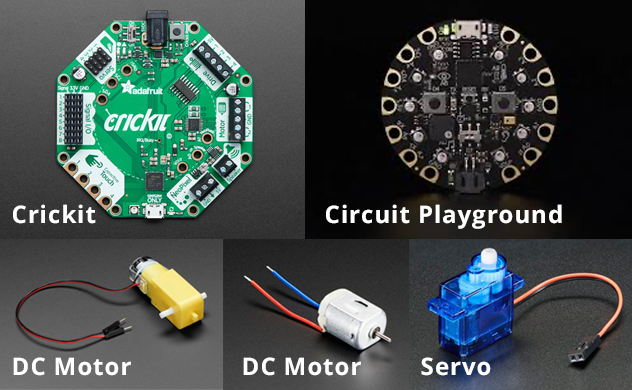

De **Circuit Playground Express** (CPE) is een programmeerbaar bordje met sensoren. De **Crickit** is een toevoeging waarmee je **motoren** kan aansluiten op de CPE!

- [Crickit Updaten](#updaten)
- [Playground toevoegen](#bouwen)
- [Circuit Playground starten](#playground)
- [Motoren aansluiten](#motoren)
- [Servo aansluiten](#motoren)
- [Meer electronica aansluiten](#tips)

 
 

# Crickit updaten

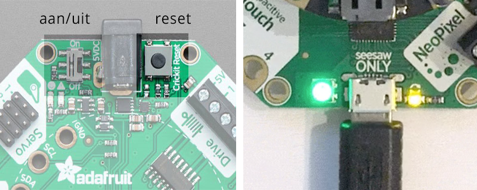

- Sluit een micro USB kabel aan op de **SEESAW ONLY** poort van de Crickit. 
- **Druk twee keer op de reset button**. De ledjes gaan groen en geel branden.
- De crickit verschijnt als USB drive op je computer.
- Download het bestand [**seesaw-crickit.uf2**](https://github.com/adafruit/seesaw/releases/download/1.1.6/seesaw-crickit.uf2) en sleep het op de Crickit USB drive.
- Als dit gelukt is kan je de USB kabel verwijderen. De SEESAW poort gebruik je verder niet meer.

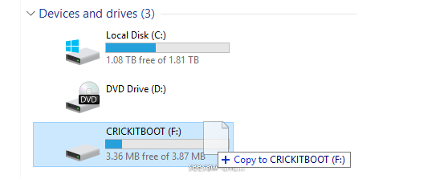

 
 

# Playground toevoegen aan crickit

Gebruik de schroefjes om de CPE op de Crickit te plaatsen. Maak het plaatje exact na. De USB poort van de CPE zit aan dezelfde kant als de zwarte stroom poort van de crickit.

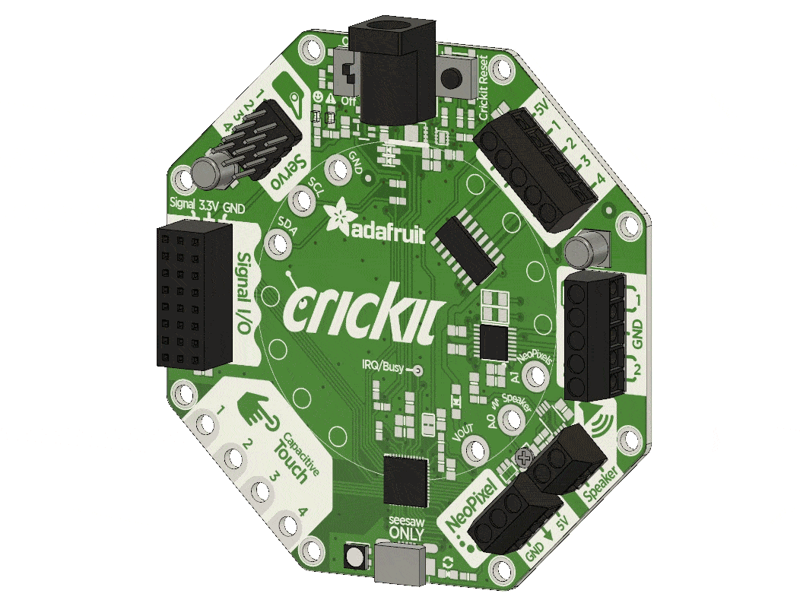

## Stroom

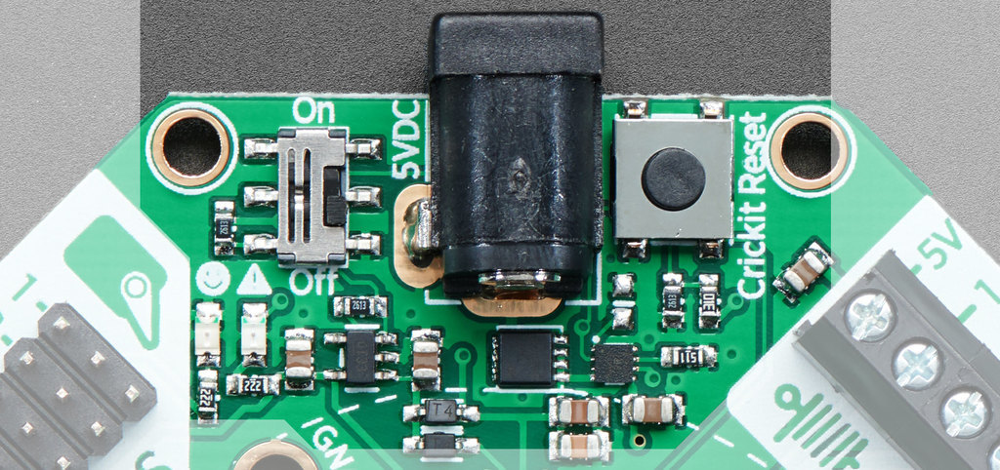

De crickit krijgt 4 tot 5 volt stroom via de zwarte 5VDC ingang. Hier kan je een **batterijhouder** of **5 volt adapter** op aansluiten. Met batterijen moet je maximaal rond de 5V stroom geven, zie de afbeelding. De crickit geeft stroom aan de playground.

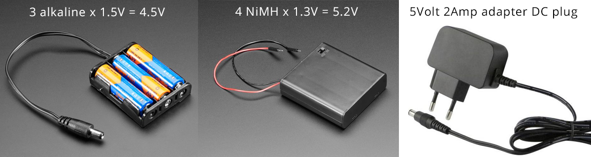

 
 

# Circuit Playground starten

Met de circuit playground ga je de robot programmeren!

- Sluit de playground met een USB kabel aan op je computer. Druk op de **reset** knop. De CPE verschijnt als USB drive op je computer.
- Open [**makecode.adafruit.com**](https://makecode.adafruit.com) in Chrome en start een nieuw project.
- Open de settings en kies voor **Pair Device** in Chrome. Kies de CPlay Express.
- Als dit niet meteen werkt kan je de **reset** knop op de CPE nog een keer indrukken of de CPE opnieuw aansluiten. Als **pair** dan nog niet werkt, kan je ook handmatig je programma's op de USB drive slepen.

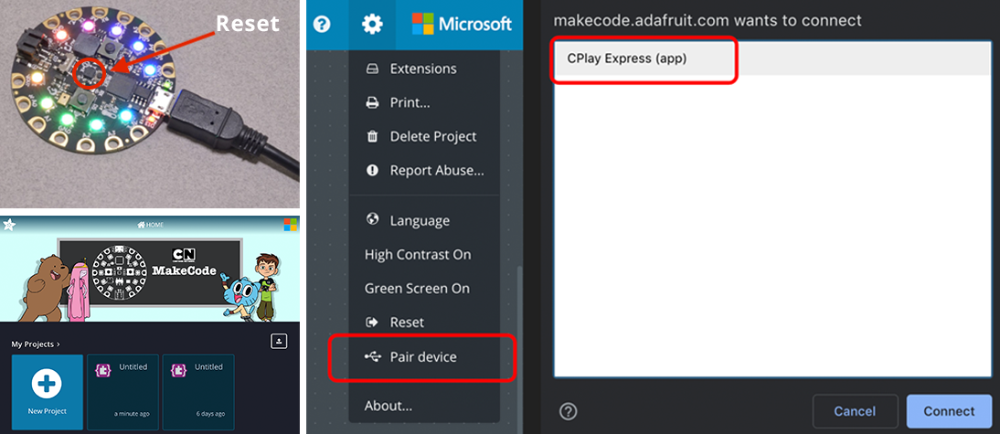

## Programma uploaden

- Maak een programma door een aantal blokken uit de **light** categorie in het werkveld te slepen. Zet de lampjes ook weer uit en bouw een pauze in. Zie het voorbeeld!
- Druk dan op de **download knop linksonder**, en kijk of de lampjes op de playground aan gaan!
- Als dat gelukt is kan je de playground afkoppelen van je computer. Het programma staat nu op de playground!
- Als de playground aan de Crickit zit, en er staat stroom op de Crickit, dan blijft je programma draaien.

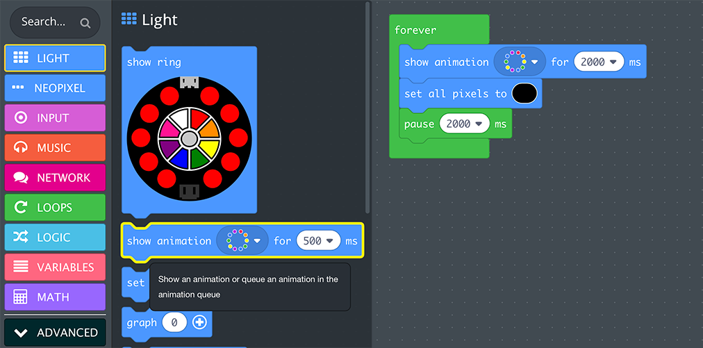

 
 

# Motoren aansluiten

Een motor gebruik je om je robot te laten rijden, of voor andere bewegingen die continu doorgaan. Je kan maximaal 2 DC motoren aansluiten op de Crickit zoals in de illustratie. De GND poort wordt niet gebruikt.

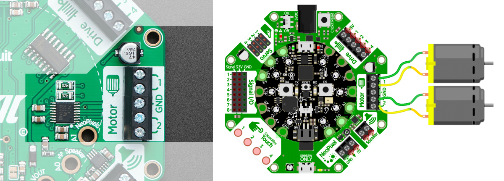

In [makecode](https://makecode.adafruit.com) moet je de **crickit extensie** toevoegen via de **extensions** knop. Dit voegt de crickit code blocks toe aan de editor. 

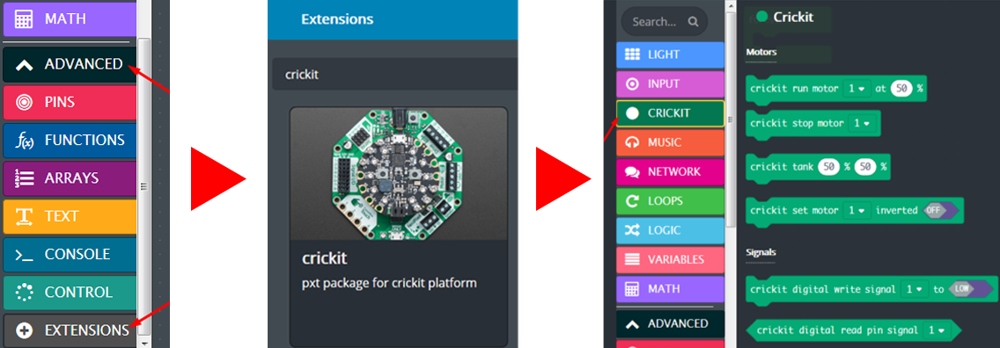

Voor de DC motor heb je de volgende vier opties:

- **run motor 1 at X%**: de snelheid van motor 1. Als je de snelheid negatief maakt, dan draait de motor de andere kant op.
- **crickit tank motors**: hiermee kan je beide motors tegelijk aansturen
- **stop**: spreekt voor zich
- **set motor inverted**: dit is hetzelfde als de snelheid een negatieve waarde geven.

Let op dat de motor blijft draaien totdat je een stop commando geeft! In dit voorbeeld draait de motor twee seconden, en wacht daarna twee seconden.

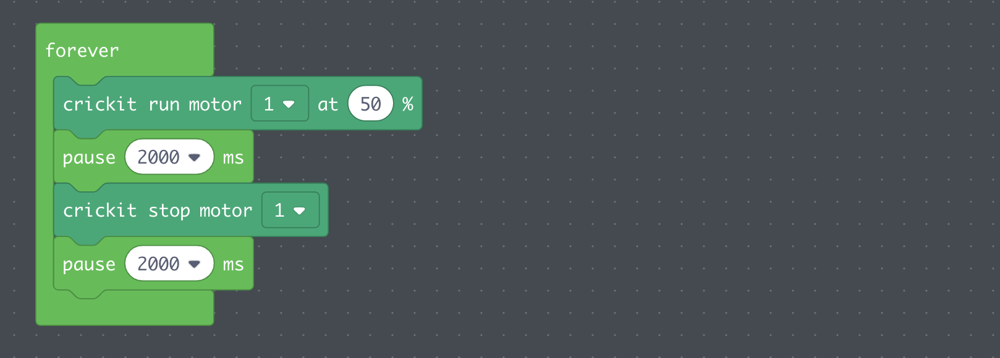

 
 

# Servo aansluiten

Een servo is een motor die je in een specifieke stand kan zetten, en die dan in die stand blijft staan. Dit kan je bv. gebruiken voor een wijzerplaat, of de wenkbrauwen van je robot. 

- Sluit de drie draden van de servo aan op de drie servo contactpunten op de crickit. Je kan maximaal vier servo's aansluiten.
- Gebruik het **crickit servo** code block om een specifieke hoek aan te geven!

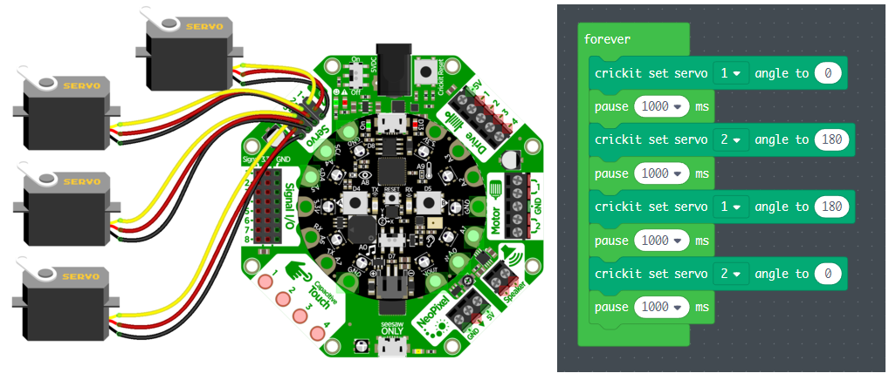

 
 

# Meer electronica aansluiten

In je starterkit zitten draden, lampjes, draaiknoppen, weerstanden, etc. etc. Lees hier verder over het aansluiten van meer electronica op je robot!

- [Meer knoppen en lampjes aansluiten op de Circuit Playground](../circuit-playground/readme.md)
- [Alle mogelijkheden van de Crickit](https://learn.adafruit.com/adafruit-crickit-creative-robotic-interactive-construction-kit?view=all)

