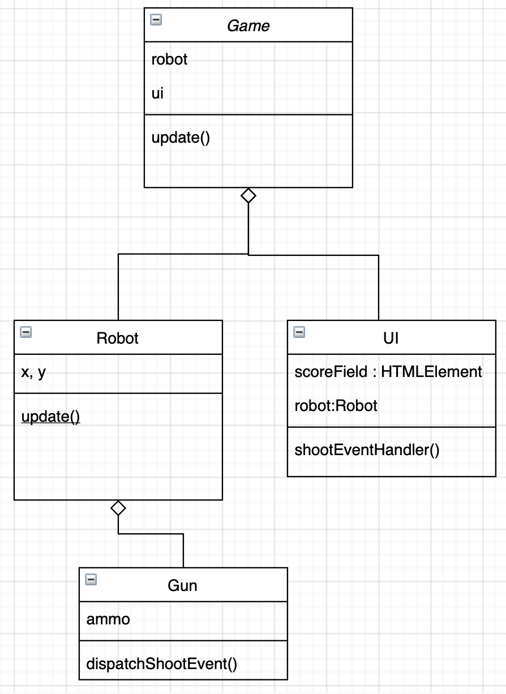

# Object Oriented Speed Course : Waarden doorgeven

In deze speed course zien we twee manieren om waarden van een class door te geven aan een andere class.

1. Onze **Game** heeft een **Robot**, daarvan willen we de **Health** en **Score** tonen in de **UI**
2. De **Robot** heeft een **Gun**, als deze schiet moet de **UI** de ammo status aanpassen.



<br>
<br>
<br>

# 1 - Referentie naar een class doorgeven

Vanuit GAME geven we een *verwijzing naar de robot* aan de ui.

GAME.TS

```typescript
export class Game {
    private robot : Robot
    private ui : UI
    
    constructor(){
        this.robot = new Robot()
        this.ui = new UI(this.robot)  // <- ui krijgt verwijzing naar robot
    }
}
```
De UI krijgt nu een verwijzing naar de robot binnen. Deze kan je opslaan in een property, en vanaf dat moment kan je waarden uit de robot rechtstreeks uitlezen in de UI.

UI.TS
```typescript
export class UI {
    private robot : Robot
    
    constructor(r : Robot){
        this.robot = r
    }
    public update (){
        console.log(this.robot.health)
        console.log(this.robot.score)
    }
}
```
Let op dat de `health` en `score` eigenschappen in de robot wel bereikbaar zijn, bv. met een `get` functie:

ROBOT.TS
```typescript
export class Robot {
    private _score : number = 0
    private _health : number = 100

    get score() {
        return this._score
    }

    get health() {
        return this._health
    }
}
```
<br>
<br>
<br>

# 2 - Luisteren naar Events

Het doorgeven van waarden via de constructor kan omslachtig worden als je een klassendiagram hebt met veel diep geneste compositions. In dit voorbeeld heeft de **Game** een **Robot**, en die heeft een **Gun**. 

De **Gun** luistert naar **keydown** events om te weten of de spatiebalk is ingedrukt.

De **UI** moet zichzelf updaten als de **Gun** geschoten heeft.

De **Gun** gaat nu een `shoot` **Event** sturen, waar we vanuit de **UI** naar kunnen luisteren. Dit doen we door het `shoot` Event via het `window` te versturen.


GUN.TS
```typescript
export class Gun {
    constructor(){
        window.addEventListener("keydown", (e: KeyboardEvent) => this.shoot(e))
    }
    private shoot(e:KeyboardEvent) {
        if(e.key === " "){
            window.dispatchEvent(new Event("shoot"))
        }
    }
}
```
In de UI luisteren we naar `shoot`:

UI.TS
```typescript
class UI {
    constructor() {
        window.addEventListener("shoot", (e:Event) => this.gunWasFired(e))
    }

    private gunWasFired(e:Event){
        console.log("a gun was fired")
    }
}
```

Je kan via het **Event** ook doorgeven welke gun heeft geschoten. Dan kan je bijvoorbeeld tonen hoeveel ammo die gun nog heeft. 

[Lees meer over Events op de code snippet pagina!](https://github.com/HR-CMGT/Typescript/blob/master/snippets/events.md)
