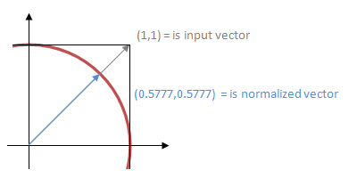
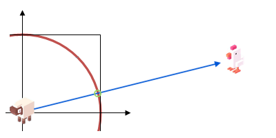

# CLE Speedcourse Top Down RPG

- Topdown map waarop je kan rondlopen
- Tiling background
- Custom hitbox zodat je achter een boom langs kan lopen
- Camera volgt speler, camera gaat niet buiten beeld
- Enemy state
- Enemy gaat je volgen zodra je in de buurt bent
- Wapens oppakken en gebruiken
- Enemy stopt met volgen als je je verstopt achter een boom

<br><br><br>

# Code Snippets

Alle snippets om de workshop te kunnen afronden

<br><br><br>

## Camera follow

Camera follows player

```js
this.currentScene.camera.strategy.elasticToActor(this.chicken, 0.2, 0.6)
this.currentScene.camera.strategy.limitCameraBounds(new BoundingBox(0, 0, 2000, 1200))
```
Player cannot leave bounding box

```js
import { clamp } from "excalibur"

onPreUpdate(engine) {
    // ...     
    this.vel = new Vector(xspeed, yspeed)
    this.pos.x = clamp(this.pos.x, 0, 2000);
    this.pos.y = clamp(this.pos.y, 0, 1200);
}
```


<br><br><br>

## Repeating tiles

Een stukje gras eindeloos laten herhalen

```js
const Resources = {
    Background: new ImageSource('images/grass.png', { wrapping: ImageWrapping.Repeat}),
}
```

```js
export class Background extends Actor {
    onInitialize(engine) {
        let sprite = new Sprite({
            image: Resources.Grass,
            sourceView: {x: 0, y: 0, width: 2000, height: 1200},
        })
        this.anchor = Vector.Zero
        this.graphics.use(sprite)
    }
}
```

<br><br><br>


## Custom hitbox

```js
export class Tree extends Actor {
    onInitialize(engine) {
        this.graphics.use(Resources.Tree.toSprite())
        this.body.collisionType = CollisionType.Fixed
        this.collider.useBoxCollider(90, 70, Vector.Half, new Vector(0, 30)); // w,h,anchor,offset
    }
}
```

<br><bR><br>

## Enemy state

Je kan een vijand wisselend gedrag geven met een `state` variabele:

```js
class Sheep extends Actor {
    state = "idle"

    onPostUpdate(engine){
        switch (this.state) {
        case "idle":
            console.log("doing nothing...")
            break;
        case "following":
            console.log("following the player!")
            break;
    }
}
```

<br><bR><br>

## Vectoren

Een vector kan je gebruiken als richting om in te lopen. Naar rechts lopen is: `let direction = new Vector(1,0)`. Dit moet je normalizen om te zorgen dat een snelheid van `1, 1` niet sneller gaat dan `1,0` of `0,1`



De `direction` vermenigvuldig je met een `speed` (bv. 200) om de uiteindelijke velocity te krijgen.

```js
let direction = new Vector(1,1)
let normalizedDirection = direction.normalize()
this.vel = normalizedDirection.scale(200)
```

De vector class heeft allerlei handige functies ingebouwd. In dit plaatje zie je de `direction` van de `Sheep` naar de `Chicken`. Dit kan je gebruiken om een actor naar een andere actor toe te laten bewegen (huisdier komt naar je toe, of een homing missile!)




```js
// afstand tussen twee vectoren
const distance = Vector.distance(engine.chicken.pos, this.pos)

// richting van een actor naar een andere actor
const vectorToChicken = engine.chicken.pos.sub(this.pos) 
const direction = vectorToChicken.normalize()

// tegenovergestelde richting
direction = direction.negate()

// richting vermenigvuldigen om een snelheid te krijgen
this.vel = direction.scale(2)

// snelheid handmatig optellen bij positie
this.pos = this.pos.add(speed)
```

<br><br><br>

## Weapon pickup

Voeg de class `Pickup` toe aan de game. Dit is alleen een plaatje van een sword met een hit event: als de `Chicken` de `Pickup` aanraakt, dan wordt de pickup verwijderd en de functie `pickUpSword` in de `Chicken` aangeroepen.

#### pickup.js

```js
class Pickup extends Actor {
    hitSomething(event){
        if(event.other.owner instanceof Chicken) {
            event.other.owner.pickupSword()
            this.kill()
        }
    }
}
```
De chicken heeft een functie om een Sword op te pakken. De chicken heeft een `attack` functie. Daarin kijk je of de kip al een wapen heeft, en zo ja, dan roep je de `attack()` functie van het zwaard aan.

#### chicken.js

```js
class Chicken extends Actor {
     weapon
     pickupSword(){
        this.weapon = new Sword()
        this.addChild(this.weapon)
     }
     attack(){
        if(this.weapon){
            this.weapon.attack()
        }
     }
}
```
#### sword.js

```js
class Sword extends Actor {
    attack(){
    }
}
```


<br><br><br>

## Line of Sight

Je kan vanuit de wereld een *raycast* doen, dit is een lijn die *alle* colliders toont waar de lijn doorheen gaat. In dit voorbeeld gebruiken we een `Ray` om te zien of er een `Tree` is tussen `Sheep` en `Chicken`.

>🐑 ------🌳-------> 🐓

SHEEP.JS
```js
onPreUpdate(engine){
    const distance = Vector.distance(engine.chicken.pos, this.pos)
    const vectorToChicken = engine.chicken.pos.sub(this.pos) 
    const direction = vectorToChicken.normalize()
    const ray = new Ray(this.pos, direction)
    const hits = this.scene.physics.rayCast(ray, {
        maxDistance: distance,
        searchAllColliders: true,
        filter: (potentialHit) => {
            return potentialHit.collider.owner instanceof Tree
        }
    })

    // check trees
    if(hits.length > 0) {
        console.log("er is minstens 1 boom tussen sheep en chicken")
    }
}
```


- [Ray documentatie](https://excaliburjs.com/docs/ray/)
- [Ray Filter](https://excaliburjs.com/api/interface/RayCastOptions/)


<br><br><br>

